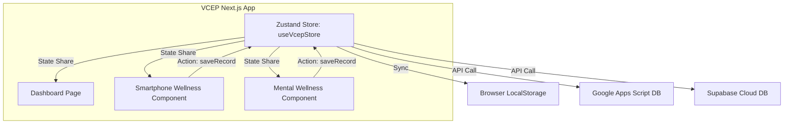

# 🏗️ VCEP 프로젝트 Next.js 이주 계획서 (Next.js Migration Plan)
> **단일 HTML 레거시 아키텍처에서 확장 가능한 모던 리액트 아키텍처로의 전환**
> 
> *본 문서는 VCEP(VibeCoding Expert Program) 플랫폼을 효율적으로 유지보수하고, 장기적인 기능 확장 및 교재(PDF) 콘텐츠 연동을 지원하기 위해 현재의 단일 HTML 구조를 Next.js 프레임워크로 이주(Migration)하기 위한 기술 계획서입니다.*

---

## 1. 🎯 이주의 목적 및 핵심 가치 (Why Next.js?)

1. **AI 에이전트와의 협업 극대화 (Token & Accuracy)**
   * 단일 HTML 내에 수천 줄로 얽힌 코드(HTML, CSS, JS)를 컴포넌트 단위로 분해하여, AI 에이전트(Antigravity, Claude Code)가 최소한의 코드로 빠르고 정확하게 기능 구현 및 디버깅을 하도록 개선합니다.
2. **복잡한 통신 및 상태 관리의 간소화**
   * 기존 마스터-하위 앱 간의 `iframe` + `postMessage` 통신 방식을 지양하고, Next.js 단일 App 하위에서 **Zustand** 혹은 **React Context API**를 사용하여 중앙 집중식 전역 상태 관리로 전환합니다.
3. **교재 콘텐츠(MDX)와의 웹 플랫폼 동기화**
   * 최종 인쇄용 PDF 원고를 **MDX(Markdown + JSX)** 형태로 보관하여, 교재 출판과 동시에 공식 웹사이트 내에 고해상도 교육 가이드 문서를 동시 퍼블리싱할 수 있는 파이프라인을 구축합니다.

---

## 2. 🔍 현재 아키텍처 현황 분석 (Current System Audit)

현재 프로젝트는 여러 개의 독립된 HTML 파일이 폴더별로 쪼개져 있으며, 로컬스토리지 및 postMessage를 통해 통신하고 있습니다.

*   `apps/app_planner.html`: 독립 기획서 생성 도구.
*   `apps/tutorial_hub.html`: AI 인턴과의 문제해결 시뮬레이션 및 실습 허브.
*   `apps/01_smartphone/`: 스마트폰 웰니스 마스터 및 8개의 개별 기능 웹앱들.
*   `apps/02_mental/`: 멘탈 웰니스 마스터 및 9개의 개별 기능 웹앱들.
*   `apps/03_expert/`: 프롬프트 디텍티브, 몬스터 스타트업 등 독자적인 시뮬레이터 게임.
*   `apps/04_gas_crud/`: 외부 GAS 연동용 샘플.

---

## 3. 🗺️ Target Next.js 아키텍처 설계 (Target Architecture)

### 📂 디렉토리 구조 (Folder Structure)

```text
vcep-nextjs/
├── public/                 # 이미지, 사운드 등 정적 자산
├── src/
│   ├── app/                # Next.js App Router
│   │   ├── layout.js       # 전역 레이아웃 (Theme, Fonts)
│   │   ├── page.js         # VCEP 메인 대시보드
│   │   ├── planner/        # App Planner 페이지 (/planner)
│   │   ├── smartphone/     # 스마트폰 웰니스 마스터 및 하위 기능 라우트
│   │   ├── mental/         # 멘탈 웰니스 마스터 및 하위 기능 라우트
│   │   ├── simulator/      # 시뮬레이터 게임 라우트 (디텍티브, 스타트업)
│   │   └── docs/           # [NEW] MDX 기반 교재 웹 가이드북 (/docs)
│   ├── components/         # 공유 UI 컴포넌트
│   │   ├── bento/          # Bento Grid 레이아웃 컴포넌트
│   │   ├── ui/             # 공통 UI 요소 (Button, Card, GlassContainer)
│   │   └── Layout.js       # 2026 트렌드 공통 레이아웃
│   ├── store/              # 전역 상태 관리 (Zustand)
│   │   └── useVcepStore.js # 사용자 학습 진도, 데이터 수집 전역 스토어
│   └── styles/
│       └── globals.css     # Tailwind CSS V4 설정
├── content/                # 교재 콘텐츠 MDX 파일 보관소
│   ├── chapter1.mdx
│   └── chapter2.mdx
├── next.config.js          # MDX 연동 설정 포함
└── package.json
```

### ⚡ 데이터 및 상태 관리 흐름 (Data Flow)



---

## 4. 🚀 단계별 이주 로드맵 (Migration Phases)

### 📌 Phase 1: 환경 구성 및 기본 테마 구축
* **목표:** Next.js 최신 템플릿 초기화 및 공통 디자인 시스템 구축.
* **주요 작업:**
  * `create-next-app`을 이용한 프로젝트 초기화 (비대화형 모드).
  * Tailwind CSS V4+ 연동 및 글로벌 CSS 글래스모피즘(Glassmorphism 2.0) 및 벤토 그리드(Bento Grid) 유틸리티 세팅.
  * 전역 레이아웃 및 폰트(Outfit/Inter 등 Google Fonts) 적용.

### 📌 Phase 2: 핵심 컴포넌트 및 기획 도구 이주
* **목표:** 기획 캔버스 및 핵심 공통 모듈 이관.
* **주요 작업:**
  * `app_planner.html` ➔ React 컴포넌트로 변환 (`/src/app/planner/page.js`).
  * 기획 데이터를 JSON 형태로 다운로드하거나 전역 상태(Zustand)에 즉시 동기화하도록 구현.

### 📌 Phase 3: 서브 앱(스마트폰 / 멘탈 웰니스) 리액트화
* **목표:** 마스터-서브 앱 간의 iframe 결합 구조 제거.
* **주요 작업:**
  * 개별 HTML 기능 파일들을 React Functional Component로 변환.
  * inline `<style>` 태그들을 Tailwind CSS 클래스로 마이그레이션.
  * 기존 `window.parent.postMessage` 전송 로직을 Zustand의 `saveRecord()` 액션 함수 호출로 전면 대체.

### 📌 Phase 4: 시뮬레이터 게임 이식 및 문서(MDX) 파이프라인 구축
* **목표:** 독자적 시뮬레이터 연동 및 교재 문서 웹 렌더링 구축.
* **주요 작업:**
  * `prompt_detective.html` 및 `monster_startup.html` 게임의 게임 루프와 UI를 리액트 생명주기(useEffect)에 맞게 포팅.
  * Next.js MDX 설정을 완료하고, `/content/` 내에 작성된 마크다운 교재 원고가 `/docs` 경로에서 자동으로 아름답게 포매팅되어 보이도록 구현.
  * Vercel 빌드 검증 및 프로덕션 배포.

---

## 🤖 5. AI 에이전트를 활용한 자율 이주 가이드

현재 레거시 HTML 소스코드를 리액트 및 테일윈드 컴포넌트로 변환할 때, AI 에이전트(Antigravity 등)에 아래 프롬프트를 활용하여 작업을 자동화합니다.

```text
[역할] 
당신은 2026년 최신 Next.js 및 Tailwind CSS V4에 정통한 리팩토링 전문가입니다.

[요청 사항]
제공된 단일 HTML 파일의 코드를 분석하여, Next.js App Router 기반의 React 기능형 컴포넌트로 리팩토링해 주세요.

[변환 규칙]
1. 기존 inline CSS 및 internal <style> 태그의 스타일은 Tailwind CSS 유틸리티 클래스로 전면 교체해 주세요. (Glassmorphism 2.0 스타일 적극 사용)
2. localStorage.setItem을 호출하여 부모 창에 postMessage를 보내던 기존 통신 로직을, Zustand 스토어인 'useVcepStore'의 'addLog(appId, data)' 액션 함수를 호출하는 방식으로 교체해 주세요.
3. React hook(useState, useEffect)을 활용하여 타이머나 입력 상태 등을 안정적으로 관리해 주세요.
4. UI는 벤토 그리드(Bento Grid) 및 반응형 레이아웃을 준수해 주세요.
```

---

## 🔗 6. 교육 리소스 연계 및 커뮤니티
* 이주가 완료된 Next.js 기반 VCEP 플랫폼의 오픈소스 리포지토리 및 실습 가이드는 아크랩스 공식 사이트와 동기화됩니다.
* **공식 파트너 허브:** [아크랩스(AKLABS) 홈페이지](https://litt.ly/aklabs)

---
*© 2026 AK Labs. All rights reserved. 본 이주 계획서의 아키텍처 세부 사항은 프로젝트 상황에 따라 점진적으로 업데이트됩니다.*
